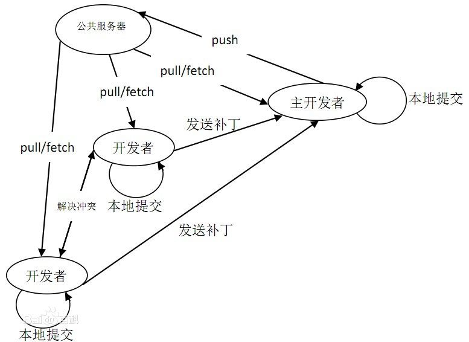

==
简介
==

**Git是一款自由和开源的分布式版本管理系统，用于敏捷高效的处理或大或小的项目；**
Git 是 Linus Torvalds 为了帮助管理 Linux 内核开发而开发的一个开放源码的版本控制软件。
Torvalds 开始着手开发 Git 是为了作为一种过渡方案来替代 BitKeeper，后者之前一直是 Linux 内核开发人员在全球使用的主要源代码工具。开放源码社区中的有些人觉得 BitKeeper 的许可证并不适合开放源码社区的工作，因此 Torvalds 决定着手研究许可证更为灵活的版本控制系统。尽管最初 Git 的开发是为了辅助 Linux 内核开发的过程，但是我们已经发现在很多其他自由软件项目中也使用了 Git。例如 最近就迁移到 Git 上来了，很多 Freedesktop 的项目也迁移到了 Git 上。

特点
==
**分布式和集中式的最大区别在于开发者可以本地提交。每个开发者机器上都有一个服务器的数据库。**

git开发过程图解
---------
下图是经典的git开发过程：

Git的功能特性
________

从一般开发者的角度来看，git有以下功能：
#)：从服务器上克隆数据库（包括代码和版本信息）到单机上。
#)：在自己的机器上创建分支，修改代码。
#)：在单机上自己创建的分支上提交代码。
#)：在单机上合并分支。
#)：新建一个分支，把服务器上最新版的代码fetch下来，然后跟自己的主分支合并。
#)：生成补丁（patch），把补丁发送给主开发者。
#)：看主开发者的反馈，如果主开发者发现两个一般开发者之间有冲突（他们之间可以合作解决的冲突），就会要求他们先解决冲突，然后再由其中一个人提交。如果主开发者可以自己解决，或者没有冲突，就通过。
#)：一般开发者之间解决冲突的方法，开发者之间可以使用pull 命令解决冲突，解决完冲突之后再向主开发者提交补丁。

